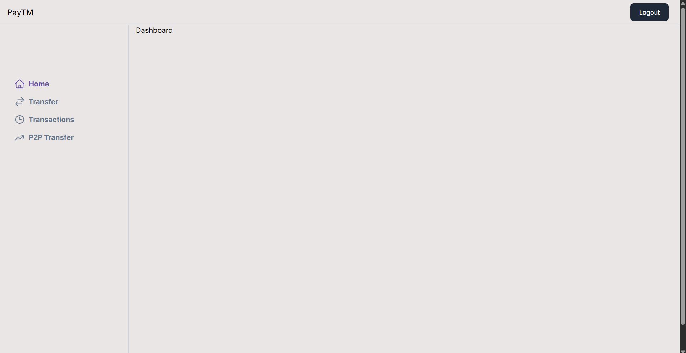
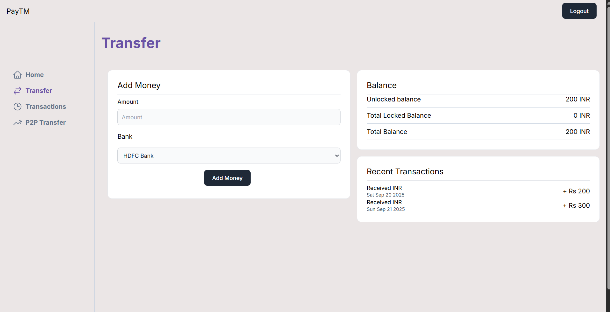

# PayTM (Clone)

  

This project is a clone of the PayTM application where real-world-like transactions take place.

It demonstrates full-stack development with authentication, database integration, and UI design.

Special Thanks to harkirat sir for this project !

  
---

  

## 🚀 Tech Stack

-  **Frontend & Backend**: Next.js

-  **Auxiliary Backend**: Express

-  **Monorepo Management**: Turborepo

-  **Database**: PostgreSQL

-  **ORM**: Prisma

-  **Styling**: Tailwind CSS

  

---

  

## 📸 Screenshots

  

| Home | Transfer | Transactions | P2P Transfer |

|------|----------|--------------|--------------|

|  |  |  |  |

  
  
  

## ⚙️ Installation & Setup

  

1. Clone the repository

```bash

git clone <https://github.com/farhanxansari/paytm.git>

cd <paytm>

```

2. Install dependencies

```bash

`npm install`

```

3. Setup database

- Create a PostgreSQL database

- Update `.env` file with your DB URL

- Run Prisma migrations

```bash

`npx prisma migrate dev`

```

4. Run the development server

```bash

`npm run dev`

```

  

## 📌 Features

  

- User authentication & authorization

- Wallet system with balance tracking

- Transaction history

- Responsive UI